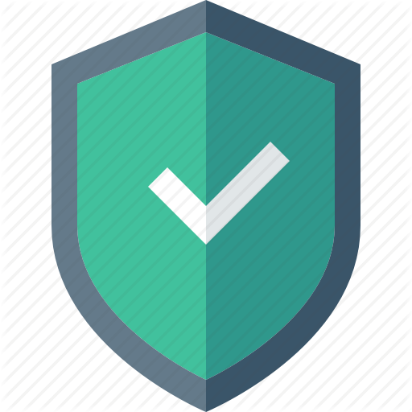

# Antivirus-software-on-html-Joke-
Plss make sure u give credit to us it's just a simple joke file to show how websites do this :)

        if(confirm('Dont close this window, if your want you PC to be protected.'))     {

        }
        else    {
                emilion();
        };

------------------------------–--------------------------
If It's secured then it shows like this 

------------------------------–--------------------------
If not then it shows like this 

------------------------------–--------------------------
Have a nice day :)
